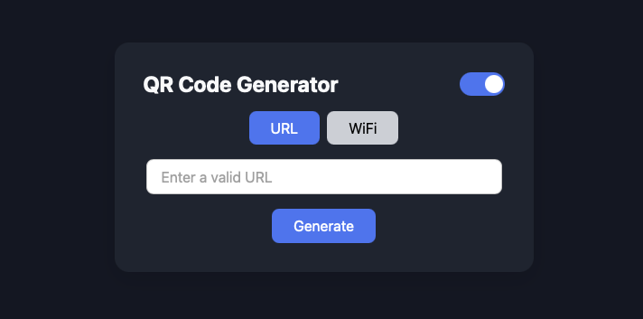

# QR Code Generator

A modern, minimalist QR Code generator built with React and TypeScript — optimized for GitHub Pages deployment.



## ✨ Features

- ✅ Generate QR codes for **URLs** and **WiFi access**
- 🌙 **Dark mode** – based on system preference or toggle manually
- 📥 **Download QR code** as PNG
- 🔁 Tab switching between QR types
- ✅ Input validation for URLs, SSIDs and passwords
- ⚡ Fast & responsive using React and CSS variables

---

## 🚀 Live Demo

👉 [Click to try it out](https://gloffler.github.io/qr)

---

## 🛠 Installation & Development

### 1. Clone the repository

```bash
git clone https://github.com/gloffler/qr.git
cd qr
```

### 2. Install dependencies

```bash
npm install
```

### 3. Start dvelopment server
```bash
npm start
```